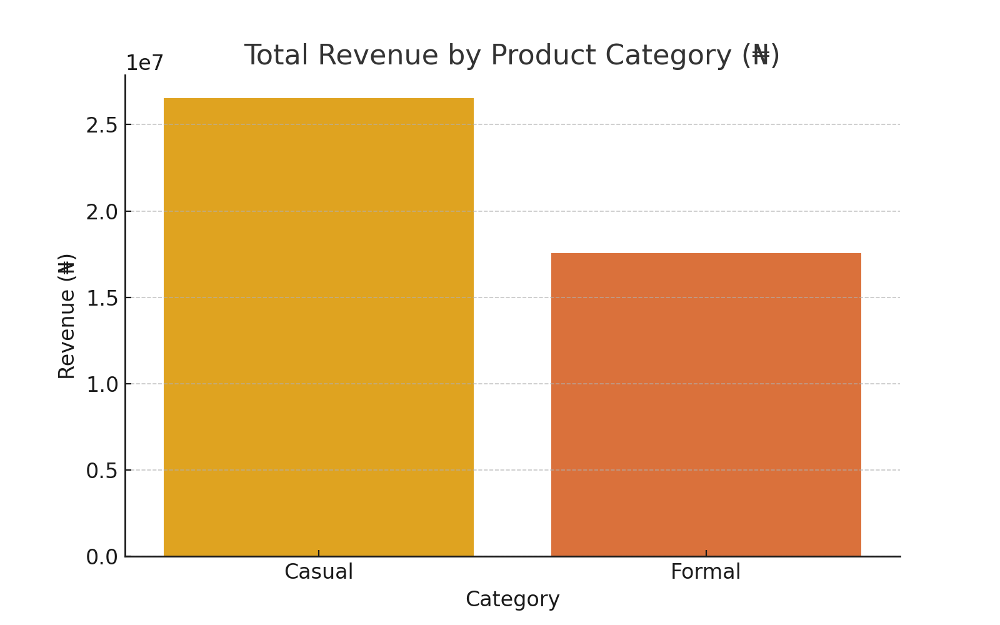
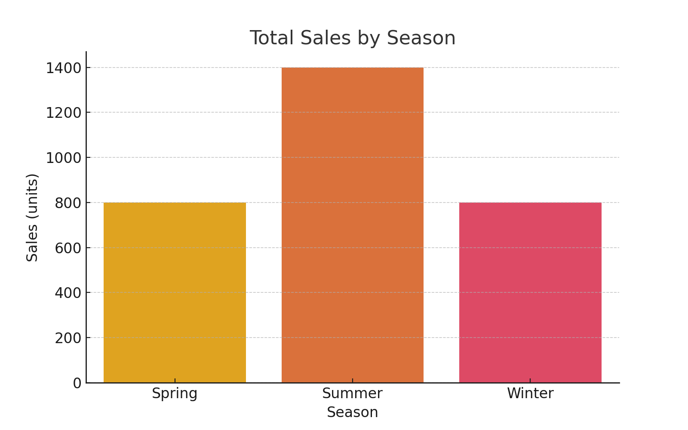
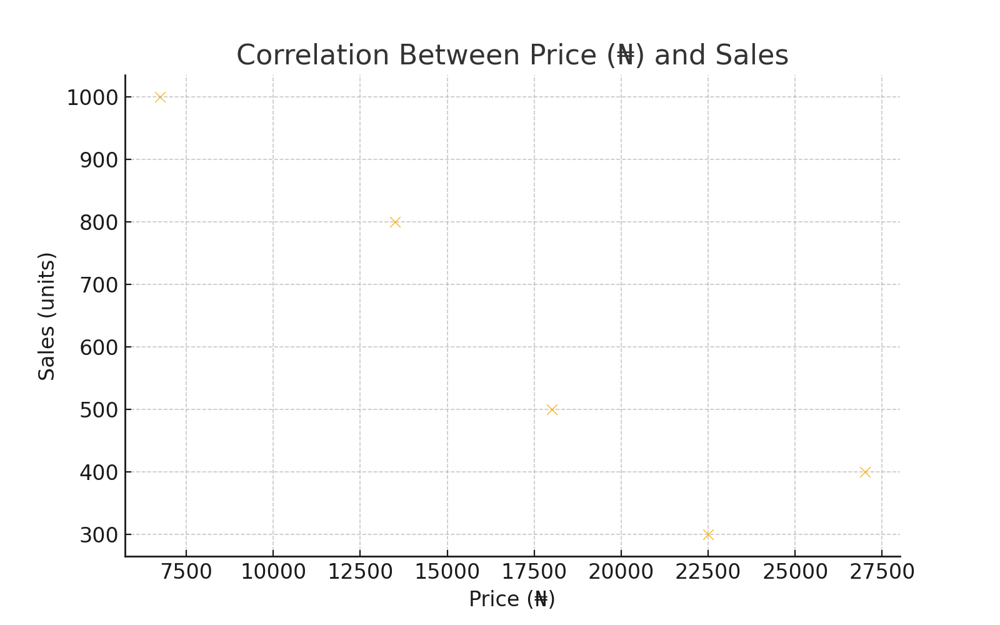
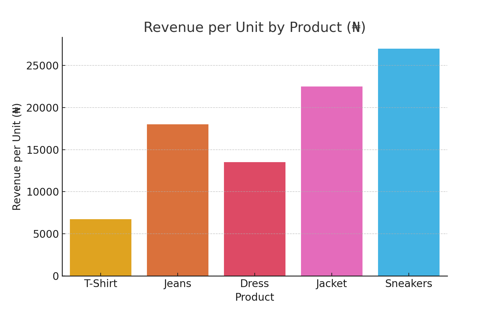
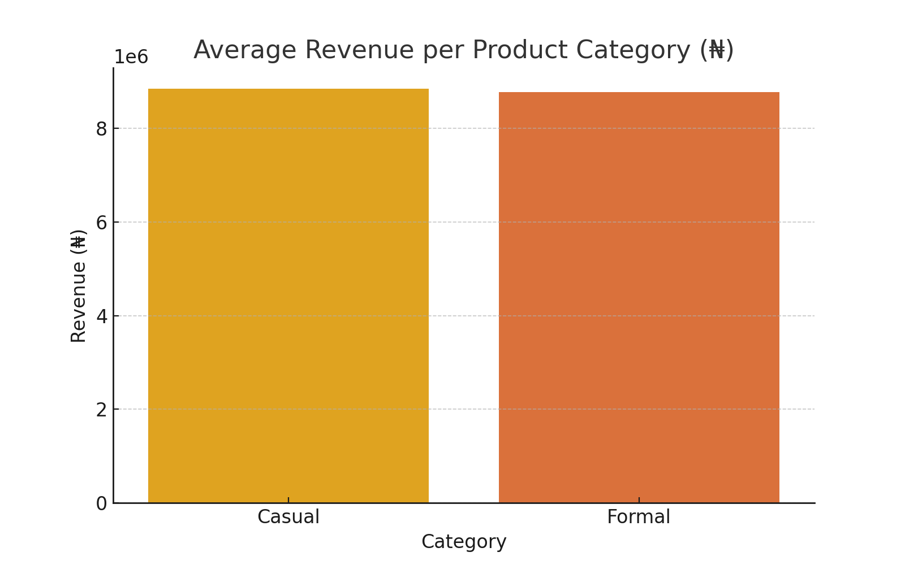

# TrendyClothes Product Pricing Analysis

## Project Overview

TrendyClothes, a fashion e-commerce company, aims to optimize its product pricing strategy to increase sales and revenue. This analysis provides insights into the provided data and offers recommendations for optimizing the pricing strategy.

## Data

The dataset includes the following columns:
- **Product**: The name of the product.
- **Price (₦)**: The price of the product in Naira.
- **Sales (units)**: The number of units sold.
- **Revenue (₦)**: The revenue generated from the product in Naira.
- **Category**: The product category (Casual or Formal).
- **Season**: The season in which the product is sold.

## Analysis and Findings

### 1. Total Revenue by Product Category

- The Formal category generates the highest revenue.

### 2. Total Sales by Season

- The Summer season has the highest sales.

### 3. Correlation Between Price (₦) and Sales

- There is a negative correlation between price and sales, indicating that higher prices may lead to lower sales.

### 4. Revenue per Unit by Product

- Sneakers generate the highest revenue per unit.

### 5. Average Revenue per Product Category

- The Formal category has a higher average revenue compared to the Casual category.

## Recommendations
1. **Focus on Casual Products**:
   - Casual products generate the highest revenue. Enhance the variety and marketing of casual products, especially during the summer season, to further boost sales and revenue.

2. **Seasonal Promotions**:
   - Since summer has the highest sales, consider implementing seasonal promotions to capitalize on the peak sales period.

3. **Price Adjustments**:
   - Given the strong negative correlation between price and sales, consider strategic price reductions for higher-priced items to boost sales. For example, lowering the price of sneakers and jackets could potentially increase their sales volume.

4. **Product-Specific Strategies**:
   - Products with high revenue per unit, such as sneakers, should be highlighted in marketing campaigns to attract more customers willing to pay a premium price.

## Conclusion

By analyzing the provided data, TrendyClothes can optimize its pricing strategy to enhance sales and revenue. The recommendations provided should help in making informed decisions to achieve business goals.

